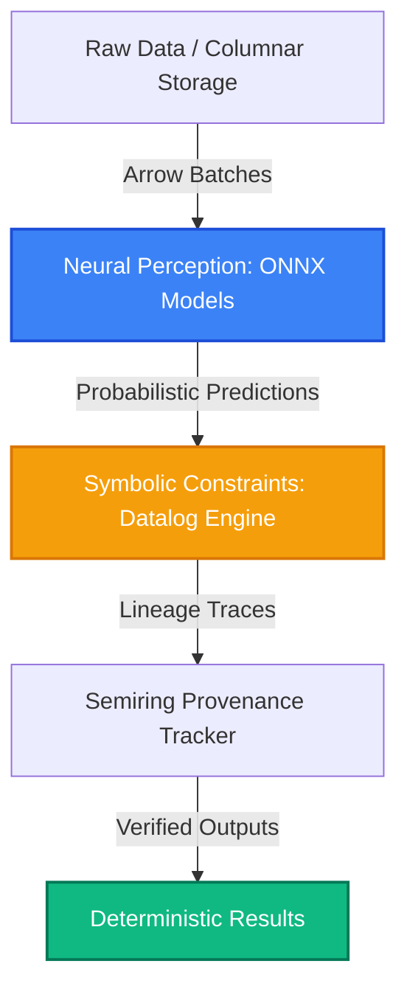

# Core Concepts

AnamDB is an **AI-Native Neurosymbolic Database Engine** designed to combine the perception capabilities of deep learning with the logical correctness and interpretability of symbolic reasoning. 

Unlike traditional databases that treat machine learning models as external endpoints, AnamDB integrates neural networks directly into the relational query execution path.

---

## Neurosymbolic Architecture

Modern AI applications suffer from a reliability crisis. Large Language Models (LLMs) and deep neural networks are prone to hallucinations, lack explainability, and do not guarantee logical correctness. Conversely, traditional symbolic databases (SQL, Datalog) are highly rigid and cannot process unstructured raw data like images, audio, or high-dimensional embeddings natively.

AnamDB bridges this gap using a **neurosymbolic execution plane**:



By compiling logic constraints into a differentiable Datalog engine, AnamDB filters the probabilistic outputs of AI models *before* they are returned. If a neural prediction contradicts a symbolic rule, the database kernel blocks the output or triggers a self-repair routing plan.

---

## Models as First-Class Citizens (FAO)

In AnamDB, models are not side-loaded UDFs. They are registered directly in the **AI-Tables catalog** as **Functions-as-Operators (FAO)**. 

### Why Native FAO?
- **Zero-Copy In-Process Execution**: Models run inside the query engine via an in-process ONNX Runtime adapter on Arrow record batches. No network serialization or gRPC overhead.
- **Hardware-Aware Dispatch**: Operations are dispatched to the CPU, Metal, CUDA GPU, or NPU depending on system architecture, model complexity, and current workload.
- **Versioned Lineage**: Each model operator is version-stamped, tracking its lifecycle and performance metadata inside a Boyce-Codd Normal Form (BCNF) catalog.

---

## Semiring Provenance

Explainability is built into the lowest levels of AnamDB. Every query execution records its computational path using **semiring provenance**. This allows developers to query *why* a particular row was returned.

AnamDB supports three provenance modes, configured depending on explainability and performance requirements:

| Provenance Mode | Underlying Semiring | Output Detail | Use Case |
|:---|:---|:---|:---|
| **Boolean** | (𝔹, ∨, ∧, false, true) | Binary (True/False) | High-speed boolean constraints |
| **Probability** | ([0, 1], max, ×, 0, 1) | Joint probability scores | Score aggregation, ranking |
| **Polynomial** | (ℕ[X], +, ×, 0, 1) | Symbolic expression formulas | Deep auditing, full-lineage debugging |

> [!TIP]
> **Polynomial mode** computes the exact lineage equations tracking every input record ID and model version that contributed to a result. It is ideal for compliance audits but has a higher computational footprint than Boolean or Probability modes.

---

## Multi-Objective Pareto Optimization

When multiple neural models can perform a perception task, they often present different trade-offs. For example, a lightweight distilled model might have low latency but moderate accuracy, while a deep ensemble model offers high accuracy but high latency and compute cost.

Rather than forcing the developer to hardcode model selection, AnamDB's query optimizer evaluates the **Pareto frontier**—the set of optimal query plans where no single dimension (Latency, Accuracy, Cost) can be improved without degrading another.


At query execution time, developers specify constraints using standard syntax extensions:

```sql
SELECT * FROM HighRisk 
WITH (max_latency_ms = 50, min_accuracy = 0.90)
```

The optimizer searches the frontier, determines the cheapest feasible plan, and dynamically routes the execution accordingly.
